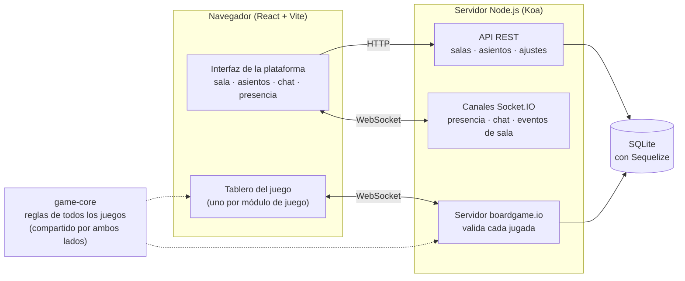
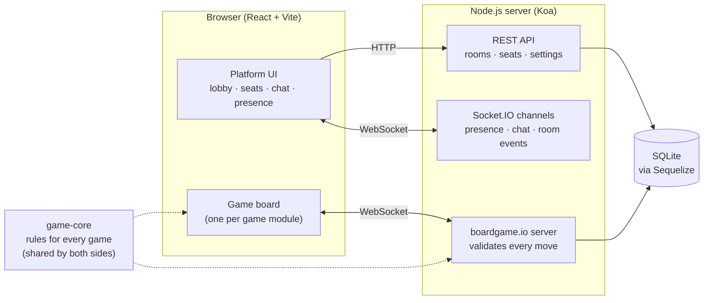

# Tableverse

**Español** · [English version below ↓](#english)

**Juega a juegos de mesa online con tus amigos: sin registro y sin instalar nada, solo un apodo y el enlace de una sala.**

Tableverse es una plataforma multijugador de juegos de mesa en tiempo real. Una persona crea una sala, comparte un código de invitación y todos juegan juntos desde el navegador. La plataforma (salas, asientos, presencia, chat, reconexión) se construye una sola vez; cada juego es un módulo independiente con su propio motor de reglas y su propio tablero.

**▶ Demo en vivo: [tableverse.pages.dev](https://tableverse.pages.dev)**

<!-- SCREENSHOT: imagen principal. Guárdala como docs/screenshots/hero.png y borra esta línea de comentario y la de cierre.
<p align="center">
  
</p>
-->

## Lo más destacado

- **Partidas en tiempo real por WebSockets, con el servidor como autoridad.** Cada jugada se valida en el servidor y se envía a todos los jugadores, así que nadie puede hacer trampas modificando el estado en su navegador, y la información oculta (tu mano) solo sale del servidor hacia ti.
- **Siete juegos jugables** detrás de un único contrato de módulo, desde el tres en raya hasta un juego original de tentar a la suerte diseñado y equilibrado para este proyecto.
- **Entrar no cuesta nada.** Sin cuentas: eliges un apodo y compartes un código de invitación privado.
- **Reconexión sin complicaciones.** Cierra la pestaña a mitad de partida, vuelve a abrirla y sigues en tu asiento.
- **Jugar en solitario es multijugador normal.** Una persona puede ocupar varios asientos (o todos) y cambiar entre ellos; pasa por el mismo código en red que una mesa completa.
- **Espectadores en directo, chat de sala con registro de eventos de la partida, tema claro/oscuro, interfaz en español e inglés, ordenación de la mano arrastrando cartas y efectos de sonido sintetizados.**
- **1.262 tests automatizados** (1.187 unitarios y de componentes + 75 de integración del servidor), incluida una suite de conformidad que todo juego debe superar.

## Los juegos

| Juego | Jugadores | Tipo | En qué consiste |
|---|---|---|---|
| **Magaluf** | 2–10 (ajustado para 3–6) | Competitivo, tentar a la suerte | Un juego original. Un viaje de tres días en el que cada copa da puntos y te acerca a un límite oculto. |
| **Regicide** | 2–4 | Cooperativo | Colaborad con una baraja de póker para derrotar a doce figuras reales cada vez más duras. |
| **The Crew: The Quest for Planet Nine** | 3–5 | Cooperativo de bazas | Completad misiones ganando las bazas adecuadas, casi sin poder comunicaros. |
| **Love Letter** | 2–6 | Competitivo, deducción | Una baraja mínima, una carta en la mano y mucho farol. Ediciones Normal y Clásica. |
| **The Mind** | 2–4 | Cooperativo, tiempo real | Jugad las cartas en orden ascendente sin hablar. No hay turnos. |
| **Mission Accomplished** (Cahoots) | 2–4 | Cooperativo | Jugad cartas en cuatro pilas por color o por número para cumplir objetivos comunes. |
| **Tres en raya** | 2 | Competitivo | El juego de referencia que validó el contrato de módulos. |

### Magaluf

Un diseño original, no una adaptación. Los jugadores pasan un fin de semana (tres días, tres locales por día) decidiendo en cada turno si se toman otra copa o se van a casa. Las copas dan puntos, pero cada mañana se roba una carta oculta de Límite, y quien termine el día por encima de él se juega en el balcón una tirada de dado que puede eliminarlo de la partida.

Como no había reglamento que implementar, el juego se diseñó primero en un prototipo independiente con un **simulador de Monte Carlo** ([prototypes/magaluf](prototypes/magaluf)) que juega decenas de miles de partidas con distintas estrategias de bot para comprobar tasas de eliminación, tasas de victoria y objetivos de equilibrio. El anfitrión puede ajustar los principales parámetros de equilibrio desde la configuración de la sala. Reglas: [Español](docs/magaluf/how-to-play.es.md) · [English](docs/magaluf/how-to-play.en.md).

<!-- SCREENSHOT: docs/screenshots/magaluf.png

-->

### Regicide

Un juego cooperativo que se juega con una baraja de póker. Los jugadores se turnan para atacar al enemigo actual (primero las jotas, luego las reinas y por último los reyes); cada palo tiene un poder: los corazones recuperan cartas para el mazo, los diamantes hacen robar, los tréboles duplican el daño y las picas protegen. Tras cada ataque el enemigo contraataca, y si un solo jugador no puede descartar lo suficiente para absorber el golpe, pierden todos. El tablero incluye una ayuda con los poderes de cada palo y un paso de defensa propio.

<!-- SCREENSHOT: docs/screenshots/regicide.png

-->

### The Crew: The Quest for Planet Nine

Un juego cooperativo de bazas. Cada misión reparte cartas de tarea, y la tripulación solo gana si el jugador correcto se lleva la baza que contiene cada carta de tarea, a veces en un orden concreto. Está prohibido hablar de las cartas; cada jugador dispone de una única pista limitada por "radio" en cada misión. Están implementadas las 21 primeras misiones del cuaderno de bitácora mediante un motor de misiones basado en datos, y tras una victoria el anfitrión puede pasar directamente a la siguiente misión con los mismos asientos.

<!-- SCREENSHOT: docs/screenshots/crew.png

-->

### Love Letter

Un juego de deducción con manos ocultas: robas una carta, juegas una de las dos que tienes e intentas eliminar a tus rivales o acabar con la carta más alta cuando se agota el mazo. Fue el primer juego con información oculta de la plataforma. Lo que todos pueden saber (quién ha elegido a quién) va al chat público, mientras que los resultados privados (la carta que has mirado) llegan únicamente al jugador que tiene derecho a verlos.

<!-- SCREENSHOT: docs/screenshots/loveletter.png

-->

### The Mind

Todos tienen cartas numeradas (del 1 al 100) y el equipo debe jugarlas todas en una única pila en orden ascendente, sin comunicarse. No hay turnos: cualquiera puede jugar en cualquier momento, así que todos los asientos están siempre activos y es el servidor quien decide en qué orden llegan las jugadas. Con los shuriken, el equipo puede votar que todos descarten su carta más baja.

<!-- SCREENSHOT: docs/screenshots/themind.png

-->

### Mission Accomplished (Cahoots)

Un juego cooperativo en el que los jugadores añaden cartas a cuatro pilas compartidas, coincidiendo en color o en número, para cumplir cartas de objetivo como "todas las pilas son verdes o azules" o "las pilas suman 10". Se pueden dar pistas, pero nunca decir qué cartas tienes. Tiene cuatro niveles de dificultad y las cartas se juegan arrastrándolas a una pila.

<!-- SCREENSHOT: docs/screenshots/cahoots.png

-->

### Tres en raya

Trivial a propósito. Existe para demostrar que se puede añadir un juego escribiendo un módulo y registrándolo, sin tocar el servidor ni la interfaz de la plataforma.

<!-- SCREENSHOT: docs/screenshots/tictactoe.png

-->

## Cómo funciona



### Tiempo real con WebSockets

El cliente mantiene cuatro conexiones Socket.IO independientes, cada una con una única función:

| Canal | Qué transporta |
|---|---|
| Estado de la partida | Entran jugadas, sale el estado filtrado para cada jugador ([boardgame.io](https://boardgame.io)) |
| Presencia | Estado de conexión de cada asiento: conectado, reconectando, desconectado |
| Chat | Mensajes de los jugadores y mensajes de sistema generados por el juego ("Ana ha jugado el Barón contra Luis") |
| Eventos de sala | Un aviso de "esta sala ha cambiado", para que todas las pantallas se actualicen en directo cuando alguien entra, ocupa un asiento o el anfitrión inicia la partida |

Al mantenerlos separados, el motor de juego no necesita saber nada del estado de conexión ni del chat, y una actualización de presencia nunca toca el estado de la partida.

### El servidor manda, con información oculta

El servidor es la única fuente de verdad. El cliente envía la jugada que quiere hacer; el servidor la valida contra las reglas, la aplica y envía a cada jugador una **vista filtrada** del nuevo estado. Las manos de tus rivales se eliminan antes de que el estado salga del servidor, y los espectadores reciben su propia vista sin ningún secreto.

### Los juegos como módulos

Cada juego implementa un contrato pequeño:

```ts
interface GameModule<G> {
  id: string;            // con versión, p. ej. "loveletter-v1"
  displayName: string;
  minPlayers: number;
  maxPlayers: number;
  gameDef: Game<G>;      // reglas: preparación, jugadas, orden de turno, condición de victoria
  settingsSchema?: JSONSchema;  // opciones configurables por el anfitrión (opcional)
}
```

El código de la plataforma nunca se bifurca según el juego que se esté ejecutando. El comportamiento específico de cada juego solo llega a la plataforma a través de este contrato:

- **Los ajustes** se declaran como un JSON Schema; la plataforma genera el formulario y lo valida en cliente y servidor con el mismo validador compartido.
- **El final de partida** sigue una única forma, así que un solo aviso anuncia victorias, derrotas, empates y la clasificación final de cualquier juego.
- **Los eventos del chat y los sonidos** los declara el juego como datos (una clave de traducción y una señal semántica como `success` o `failure`); la plataforma decide cómo se ven y cómo suenan.

Un generador crea el esqueleto de un nuevo módulo de juego, con tests y listo para compilar:

```bash
npm run new-game -- mygame "My Game"
```

### Suite de conformidad

Todos los módulos de juego pasan la misma suite automática, que comprueba que:

- la preparación produce un estado válido con el mínimo y el máximo de jugadores,
- el estado de la partida se mantiene serializable a JSON durante una partida completa,
- ningún jugador ni espectador puede ver la información oculta de otro jugador,
- repetir las mismas jugadas con la misma semilla da el mismo resultado.

### Asientos, juego en solitario y reconexión

Un usuario que controla varios asientos ejecuta un cliente de juego independiente por asiento en la misma pestaña y cambia entre ellos; solo se muestra la vista del asiento activo, de modo que sus secretos no pueden filtrarse a otro. Las credenciales de asiento que emite el servidor se guardan en `localStorage`, así que al recargar o reabrir la pestaña se reconectan todos los asientos automáticamente. Los miembros que no han ocupado ningún asiento ven la partida en directo como espectadores.

### Otros detalles

- **Permisos como datos**: lo que pueden hacer el anfitrión y los miembros está en una única tabla que consulta cada acción de sala, en lugar de condiciones `if (isHost)` repartidas por el código.
- **Almacenamiento detrás de interfaces**: el almacenamiento de partidas y de salas se inyecta, de modo que pasar de SQLite a PostgreSQL es un cambio de configuración.
- **Sonido sin archivos de audio**: los efectos se sintetizan con la Web Audio API.
- **i18n**: español e inglés, con un test que falla si los dos archivos de traducción dejan de coincidir.

## Tecnologías

| Área | Tecnología |
|---|---|
| Lenguaje | TypeScript (modo estricto) en todo el monorepo |
| Cliente | React 18, Vite, CSS Modules, dnd-kit, react-i18next |
| Servidor | Node.js 22, Koa, Socket.IO |
| Motor de juego | boardgame.io |
| Base de datos | SQLite con Sequelize (preparado para PostgreSQL) |
| Tests | Vitest, React Testing Library |
| Herramientas | npm workspaces, ESLint, Prettier |
| Despliegue | Cloudflare Pages (cliente), Docker Compose + Caddy en una VM de Oracle Cloud (servidor), GitHub Actions |

## Estructura del proyecto

```
packages/
  game-core/   Reglas y tableros de todos los juegos, el contrato GameModule
               y la suite de conformidad
  server/      Servidor Koa + boardgame.io, salas, asientos, presencia, chat
  client/      Aplicación React: sala, gestión de asientos, chat, montaje del juego
  shared/      Tipos y lógica compartidos por servidor y cliente (roles, permisos)
prototypes/    Prototipo de diseño y simulador de equilibrio de Magaluf
spec/          Constitución del proyecto y una especificación escrita por funcionalidad
docs/          Reglas para los jugadores
```

## Ejecutarlo en local

Requiere Node.js 22 o superior.

```bash
npm install
```

```bash
npm run dev
```

Esto arranca el servidor en `http://localhost:8000` y el cliente en `http://localhost:5173`. Abre el cliente en dos ventanas del navegador (o en una normal y otra privada) para jugar contra ti mismo, o activa los asientos múltiples en la sala y ocupa todos desde una sola ventana.

| Comando | Qué hace |
|---|---|
| `npm run test:unit` | Tests de reglas, de conformidad y de componentes |
| `npm run test:integration` | Tests del servidor: salas, asientos, presencia y chat |
| `npm run typecheck` | TypeScript en todos los paquetes |
| `npm run lint` | ESLint |

## Despliegue

- **Cliente**: Cloudflare Pages lo compila y lo publica en cada push.
- **Servidor**: un contenedor Docker detrás de Caddy (HTTPS automático) en una VM de Oracle Cloud. Un workflow de GitHub Actions lo vuelve a desplegar con cada push a `main` que toque código del lado del servidor.

Consulta [docker-compose.yml](docker-compose.yml), [.env.example](.env.example) y [.github/workflows/deploy-server.yml](.github/workflows/deploy-server.yml).

## Cómo se ha construido

El proyecto sigue un flujo de trabajo guiado por especificaciones. Una breve constitución ([misión](spec/constitution/mission.md), [stack técnico](spec/constitution/tech-stack.md), [hoja de ruta](spec/constitution/roadmap.md)) recoge las decisiones de arquitectura vinculantes y su justificación, y cada funcionalidad tiene su propia especificación, plan y lista de tareas en [spec/features](spec/features), escritos antes de implementarla. Esos documentos están en inglés.

## Aviso legal

Love Letter, The Mind, Regicide, The Crew y Cahoots son propiedad de sus respectivos autores y editoriales. Las implementaciones de este repositorio son versiones no oficiales y sin ánimo de lucro, hechas por un aficionado para jugar en privado entre amigos y como proyecto de portfolio, y no están afiliadas a los titulares de los derechos ni cuentan con su respaldo. Si te gustan, compra los juegos originales.

---

<a id="english"></a>

# Tableverse (English)

[↑ Versión en español](#tableverse)

**Play board games online with friends — no sign-up, no install, just a nickname and a room link.**

Tableverse is a real-time multiplayer board game platform. One person creates a room, shares an invite code, and everyone plays together in the browser. The platform (rooms, seats, presence, chat, reconnection) is built once; each game is an independent plug-in module with its own rules engine and board UI.

**▶ Live demo: [tableverse.pages.dev](https://tableverse.pages.dev)**

<!-- SCREENSHOT: hero image. Save it as docs/screenshots/hero.png, then delete this comment line and the closing one below.
<p align="center">
  
</p>
-->

## Highlights

- **Real-time, server-authoritative gameplay over WebSockets.** Every move is validated on the server and pushed to all players, so nobody can cheat by editing client state, and hidden information (your hand) never leaves the server for anyone but you.
- **Seven playable games** behind a single plug-in contract, from Tic-Tac-Toe to an original push-your-luck game designed and balanced for this project.
- **Zero-friction entry.** No accounts: pick a nickname, share a private invite code.
- **Reconnection that just works.** Close the tab mid-game, reopen it, and you are back in your seat.
- **Solo play is ordinary multiplayer.** One person can claim several seats (or all of them) and switch between them; it runs through exactly the same networked code path as a full table.
- **Live spectators, room chat with a game event feed, light/dark themes, English/Spanish UI, drag-and-drop hand sorting, and synthesized sound cues.**
- **1,262 automated tests** (1,187 unit/component + 75 server integration), including a conformance suite every game must pass.

## The games

| Game | Players | Type | What it is |
|---|---|---|---|
| **Magaluf** | 2–10 (tuned for 3–6) | Competitive, push-your-luck | An original game. A three-day trip where every drink scores points and brings you closer to a hidden limit. |
| **Regicide** | 2–4 | Co-op | Work together with a standard card deck to defeat twelve increasingly tough royals. |
| **The Crew: The Quest for Planet Nine** | 3–5 | Co-op trick-taking | Complete missions by winning the right tricks, with almost no communication allowed. |
| **Love Letter** | 2–6 | Competitive, deduction | A tiny deck, one card in hand, and a lot of bluffing. Normal and Classic editions. |
| **The Mind** | 2–4 | Co-op, real-time | Play cards in ascending order without speaking. There are no turns. |
| **Mission Accomplished** (Cahoots) | 2–4 | Co-op | Play cards onto four piles by colour or number to complete shared goals. |
| **Tic-Tac-Toe** | 2 | Competitive | The reference game that proved the plug-in contract. |

### Magaluf

An original design, not an adaptation. Players spend a weekend (three days, three venues a day) deciding each turn whether to take another drink or go home. Drinks bank points, but each morning a hidden Drinking Limit card is drawn, and whoever ends the day over it faces a dice roll on the balcony that can eliminate them from the game.

Because there was no rulebook to implement, the game was designed first in a standalone prototype with a **Monte Carlo simulator** ([prototypes/magaluf](prototypes/magaluf)) that plays tens of thousands of games with bot policies to check death rates, win rates, and balance targets. The host can tune the main balance dials from the room settings. Rules: [English](docs/magaluf/how-to-play.en.md) · [Español](docs/magaluf/how-to-play.es.md).

<!-- SCREENSHOT: docs/screenshots/magaluf.png

-->

### Regicide

A cooperative game played with a poker deck. Players take turns attacking the current enemy (Jacks, then Queens, then Kings); each suit has a power — hearts heal the deck, diamonds draw cards, clubs double damage, spades shield. After every attack the enemy hits back, and if any one player cannot discard enough to absorb it, everyone loses. The board includes an in-game suit-power reference and a dedicated defend step.

<!-- SCREENSHOT: docs/screenshots/regicide.png

-->

### The Crew: The Quest for Planet Nine

A cooperative trick-taking game. Each mission deals out task cards, and the crew wins only if the right player wins the trick containing each task card, sometimes in a required order. Table talk is forbidden; each player gets one limited "radio" hint per mission. The first 21 missions of the logbook are implemented through a data-driven mission engine, and after a win the host can jump straight to the next mission with the same seating.

<!-- SCREENSHOT: docs/screenshots/crew.png

-->

### Love Letter

A deduction game with hidden hands: draw a card, play one of your two, and try to knock opponents out or hold the highest card when the deck runs out. This was the first hidden-information game on the platform. Results everyone may know (who targeted whom) go to the public chat feed, while private results (the card you peeked at) reach only the player entitled to see them.

<!-- SCREENSHOT: docs/screenshots/loveletter.png

-->

### The Mind

Everyone holds numbered cards (1–100) and the team must play them all into one pile in ascending order, without communicating. There are no turns: any player can play at any moment, so every seat is permanently active and the server decides the order moves arrive in. Shuriken votes let the team agree to discard everyone's lowest card.

<!-- SCREENSHOT: docs/screenshots/themind.png

-->

### Mission Accomplished (Cahoots)

A cooperative game where players add cards to four shared piles, matching by colour or number, to satisfy goal cards such as "all piles are green or blue" or "the piles sum to 10". You can hint, but never say what you hold. Four difficulty levels, and cards are played by dragging them onto a pile.

<!-- SCREENSHOT: docs/screenshots/cahoots.png

-->

### Tic-Tac-Toe

Deliberately trivial. It exists to prove that a game can be added by writing one module and registering it, without touching the server or the platform UI.

<!-- SCREENSHOT: docs/screenshots/tictactoe.png

-->

## How it works



### Real-time over WebSockets

The client holds four separate Socket.IO connections, each with one job:

| Channel | Carries |
|---|---|
| Game state | Moves in, per-player filtered state out ([boardgame.io](https://boardgame.io)) |
| Presence | Per-seat connection status: connected, reconnecting, disconnected |
| Chat | Player messages plus system messages generated by the game ("Ana played the Baron on Luis") |
| Room events | A "this room changed" ping, so every lobby updates live when someone joins, claims a seat, or the host starts the match |

Keeping them apart means the game engine never has to know about connection state or chat, and a presence update never touches game state.

### Server-authoritative, with hidden information

The server is the only source of truth. A client sends an intended move; the server validates it against the rules, applies it, and sends each player a **filtered view** of the new state. Your opponents' hands are stripped out before the state ever leaves the server, and spectators get their own view with all secrets removed.

### Games as plug-ins

Every game implements one small contract:

```ts
interface GameModule<G> {
  id: string;            // versioned, e.g. "loveletter-v1"
  displayName: string;
  minPlayers: number;
  maxPlayers: number;
  gameDef: Game<G>;      // rules: setup, moves, turn order, win condition
  settingsSchema?: JSONSchema;  // optional host-configurable options
}
```

Platform code never branches on which game is running. Game-specific behaviour reaches the platform only through this contract:

- **Settings** are declared as a JSON Schema; the platform renders the form and validates it on both client and server with the same shared validator.
- **Game-over** results follow one shape, so a single banner announces wins, losses, draws and final standings for every game.
- **Chat events and sounds** are declared by the game as data (a translation key plus a semantic cue like `success` or `failure`); the platform decides how they look and sound.

A generator scaffolds a new compiling game module with tests:

```bash
npm run new-game -- mygame "My Game"
```

### Conformance suite

Every game module runs the same automated suite, which checks that:

- setup produces a valid state at minimum and maximum player counts,
- game state stays JSON-serializable throughout a played-out game,
- no player or spectator can see another player's hidden information,
- replaying the same moves with the same seed gives the same result.

### Seats, solo play and reconnection

A user controlling several seats runs one independent game client per seat in the same tab and switches between them; only the active seat's view is ever rendered, so its secrets cannot leak into another. Seat credentials issued by the server are kept in `localStorage`, so reloading or reopening the tab reconnects every seat automatically. Members who have not claimed a seat watch the match live as spectators.

### Other details

- **Permissions as data**: host and member capabilities live in one table that every room action checks, rather than scattered `if (isHost)` conditions.
- **Storage behind interfaces**: match and room storage are injected, so moving from SQLite to PostgreSQL is a configuration change.
- **Sound without audio files**: cues are synthesized with the Web Audio API.
- **i18n**: English and Spanish, with a test that fails if the two locale files drift apart.

## Tech stack

| Area | Technology |
|---|---|
| Language | TypeScript (strict) across the whole monorepo |
| Client | React 18, Vite, CSS Modules, dnd-kit, react-i18next |
| Server | Node.js 22, Koa, Socket.IO |
| Game engine | boardgame.io |
| Database | SQLite via Sequelize (PostgreSQL-ready) |
| Testing | Vitest, React Testing Library |
| Tooling | npm workspaces, ESLint, Prettier |
| Deployment | Cloudflare Pages (client), Docker Compose + Caddy on an Oracle Cloud VM (server), GitHub Actions |

## Project structure

```
packages/
  game-core/   Rules and board components for every game, the GameModule
               contract, and the conformance suite
  server/      Koa + boardgame.io server, rooms, seats, presence, chat
  client/      React app: lobby, room, seat management, chat, game mounting
  shared/      Types and logic shared by server and client (roles, permissions)
prototypes/    Magaluf design prototype and balance simulator
spec/          Project constitution and one written spec per feature
docs/          Player-facing rules
```

## Run it locally

Requires Node.js 22+.

```bash
npm install
```

```bash
npm run dev
```

This starts the server on `http://localhost:8000` and the client on `http://localhost:5173`. Open the client in two browser windows (or one normal and one private window) to play against yourself, or enable multi-seat in the room and claim every seat from one window.

| Command | What it does |
|---|---|
| `npm run test:unit` | Rules, conformance and component tests |
| `npm run test:integration` | Server tests for rooms, seats, presence and chat |
| `npm run typecheck` | TypeScript across all packages |
| `npm run lint` | ESLint |

## Deployment

- **Client**: built and hosted by Cloudflare Pages on every push.
- **Server**: a Docker container behind Caddy (automatic HTTPS) on an Oracle Cloud VM. A GitHub Actions workflow redeploys it on pushes to `main` that touch server-side code.

See [docker-compose.yml](docker-compose.yml), [.env.example](.env.example) and [.github/workflows/deploy-server.yml](.github/workflows/deploy-server.yml).

## How it was built

The project follows a spec-driven workflow. A short constitution ([mission](spec/constitution/mission.md), [tech stack](spec/constitution/tech-stack.md), [roadmap](spec/constitution/roadmap.md)) records the binding architectural decisions and the reasoning behind them, and each feature has its own spec, plan and task list under [spec/features](spec/features) written before implementation.

## Disclaimer

Love Letter, The Mind, Regicide, The Crew and Cahoots are the property of their respective designers and publishers. Their implementations here are unofficial, non-commercial fan versions made for private play among friends and as a portfolio project, and are not affiliated with or endorsed by the rights holders. If you enjoy them, please buy the real games.
